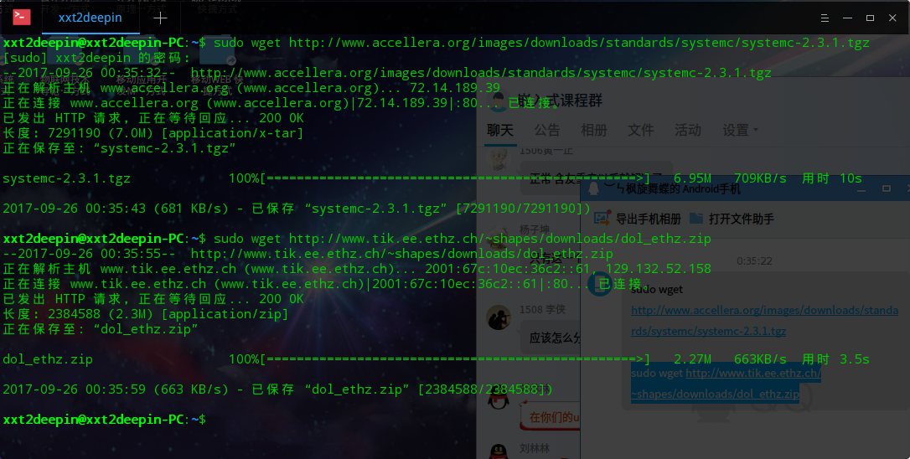

嵌入式系统导论实验报告
=
---

|  姓名  |  学号  |  班级  |  电话  |  邮箱  |
| :--: | :--: | :--: | :--: | :--: |
| 许先涛  |15352367|1516|17612034037 |ku8834367@163.com|
---
###1.实验题目
##&emsp;DOL开发环境配置

###2.实验结果
* 下载相关软件环境

 
* 编译systemc，运行configure

 
* 运行install  

 
* 修改dol文件中的build_zip.xml文件

 
* 编译ant文件

 
* 编译第一个example

(由于C++版本过高出现错误，检查后发现在新版本中是函数std:gets没有识别出来)

 
* 上网查找解决方案如下

 
* 运行后successful

###3.实验心得
&emsp;&emsp;这次实验也是主要照着ppt的提示完成就ok了，遇到的问题也就是最后一步的build由于系统自带gcc版本较高无法识别出systemc库中的std:gets导致的编译失败，所以只要将std::gets给相应注释掉就OK了。